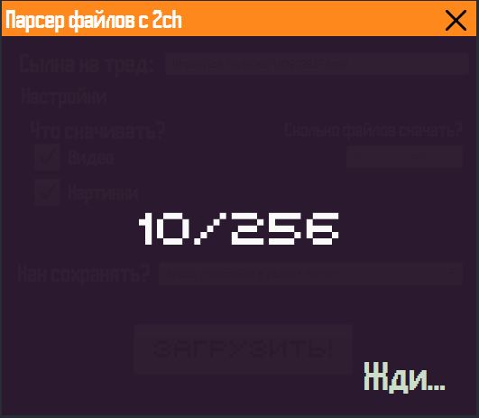

# Parser2ch
Мой Hello, world! на javafx
Сделано за пару часов.

## Так для чего же эта программа?
###### С ее помощью можно скачать всё картинки\вебм с определенного треда с 2ch.hk
###### Сохраняет в корень программы в папку вида "ДАТА(ДОСКА- Thread НОМЕР ТРЕДА)"

Использует либу json-simple-1.1.1  
Не упакованный jar c lib в /dist/  
Упакованый в releases  

Может кому-то и пригодиться.    
На баги не тестировал, на других ос тоже. Работает на win10 1803 (x64)

* * *

